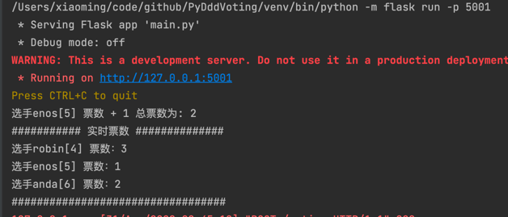
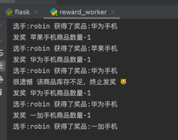

# DDD Python Example VotingSystem

### 目的：

领域驱动设计 Domain driven design

python 学习实践demo

### 简单业务需求：

投票系统：

- 用户能对选手进行投票

- 用户限定每天只能投一次

- 统计每小时获得票数最多选手获得仓库随机奖品

1. 角色

    - 用户

    - 选手

2. 行为

    - 用户对选手今天投票

    - 系统给每天票数最多用户发奖

### 设计：

投票领域拆分：

- 投票子域

- 风控子域

- 奖品子域

模块结构编排：

- Entity

    - User -- 用户

    - Player -- 选手

    - Prize -- 奖品

- ValueObject

- AggregateRoot
    - Vote

### 环境：

python 3.9.13

```bash
pip3 install -r requirements.txt
```

### 启动：

- Api Service
```bash
export FLASK_APP=main.py
flask run -p 5001
```
- 发奖后台任务
```bash
python vote/application/reward_worker.py 
```

### 测试

```bash

curl 127.0.0.1:5001/voting -X POST -d '{"user_id": 1, "player_id": 4}' --header "Content-Type: application/json"


```
- 投票控制台
<br>


- 发奖后台任务
<br>

